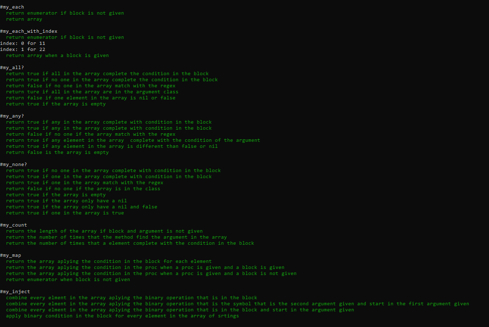

# Enumerables Methods

> This is a collaborative project with Ruby for a Enumerable methods.

## Built With

-Ruby

## Install
- Download Ruby from https://www.ruby-lang.org/en/ to run it locally .

### Rspec Test
You need to install it with `gem install rspec` to run the next test

To run the test type `rspec methods_rspec.rb --format documentation` in your terminal after instal rspec

## Clone
- Clone the repository from https://github.com/atenaiis/enumerables

## Run
-Run code with  `ruby main.rb`in your local terminal

## Live Demo
[Live Demo Link](https://repl.it/@pastorp3/enumerables#main.rb)

## Authors

👤 **José Pedraza**
- Github: [@pastorp3](https://github.com/pastorp3)
- Twitter: [@jose_pastor](https://twitter.com/jose_pastorp3 )
- Linkedin: [linkedin](https://www.linkedin.com/in/jos%C3%A9-pedraza-acevedo-ab700a1a9/)

👤 **Tadeu Sarro**
- Github: [@tadeuasarro](https://github.com/tadeuasarro)
- Twitter: [@tadeuasarro](https://twitter.com/tadeuasarro)
- Linkedin: [Tadeu Sarro](https://www.linkedin.com/in/tadeuasarro/)

## 🤝 Contributing

Contributions, issues and feature requests are welcome!

Feel free to check the [issues page](https://github.com/pastorp3/Advanced-Building-Blocks---Bubble-Sort/issues).

## Show your support

Give a ⭐️ if you like this project!

## Acknowledgments

- Hat tip to anyone whose code was used
- Inspiration
- etc

## 📝 License

This project is [MIT](lic.url) licensed.
